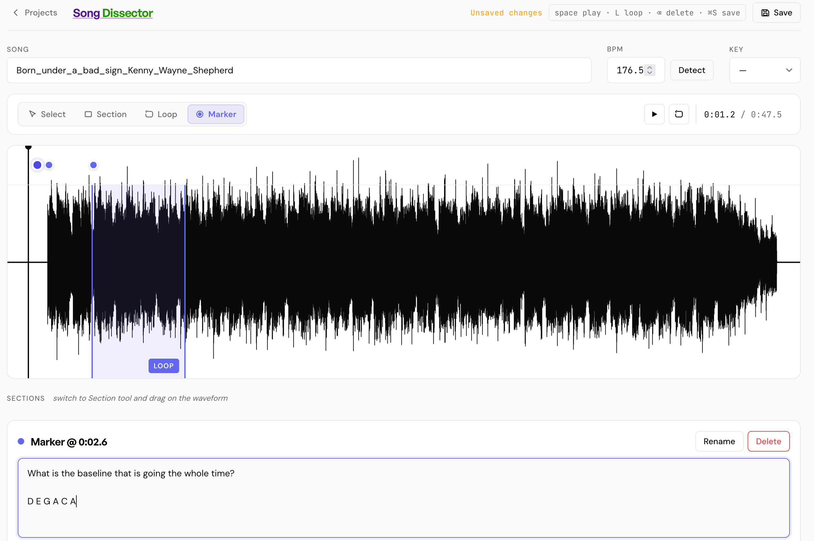
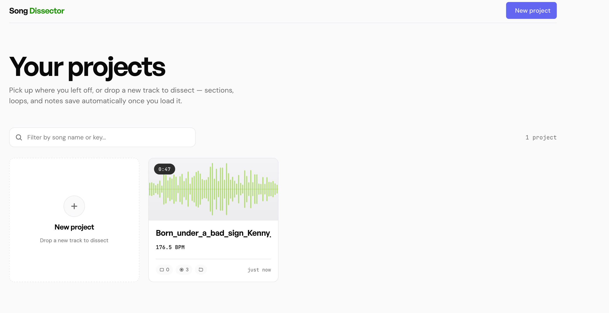

# Song Dissector

A single-page web app for taking apart a song to figure out how it's made.
Drop in an audio file, mark up the structure, loop the sections you want to
study, and write down what you hear — every note stays attached to the exact
moment in the track it refers to.

Backed by a small FastAPI service that stores each project (annotations + the
original audio) on disk, so a song you start dissecting today is still there
the next time you open the page.





---

## Features

- **Drag-and-drop loading.** Any browser-decodable audio file (MP3, WAV, FLAC,
  M4A, OGG). The waveform is rendered to a canvas at native resolution.
- **Auto BPM detection.** A short autocorrelation pass over the onset envelope
  estimates tempo on load; you can override it manually.
- **Three annotation tools layered on the timeline:**
  - **Sections** — drag across the waveform to box off a region (intro, verse,
    chorus, bridge, solo, outro, anything). Each gets its own colour and a
    notes pane.
  - **Loop region** — a single indigo band marking the part of the song you
    want to repeat. Playback uses the native `loopStart`/`loopEnd` properties
    on `AudioBufferSourceNode` so the seam is sample-accurate.
  - **Markers** — dots in their own lane along the top of the waveform; click
    to drop one and the notes editor opens for it.
- **Notes bound to selection.** Click any marker, section, or the loop region
  and the bottom editor loads its notes; type to edit. Sections can be
  renamed, anything can be deleted, regions and markers are draggable and
  resizable.
- **Project persistence.** Save (Cmd/Ctrl+S) writes the project — metadata,
  every annotation, and on the first save the audio file itself — to the
  backend. Subsequent saves are JSON-only updates.
- **Project gallery.** The home page lists every saved project as a card with
  a generated mini-waveform, song name, BPM, key, counts, and last-updated
  time. Click to reopen.

## Keyboard shortcuts

| Key | Action |
|---|---|
| `Space` | Play / pause |
| `L` | Toggle loop-only playback |
| `Cmd/Ctrl+S` | Save project |
| `Backspace` / `Delete` | Delete the selected element |
| `Esc` | Clear selection |
| `1` / `2` / `3` / `4` | Switch to Select / Section / Loop / Marker tool |

## Tech stack

- **Frontend:** vanilla HTML + JS, no build step, no framework. Web Audio API
  for decode + playback, Canvas for the waveform, absolutely-positioned divs
  for overlays.
- **Backend:** [FastAPI](https://fastapi.tiangolo.com/) +
  [uvicorn](https://www.uvicorn.org/), serving the two HTML pages and a small
  REST API. Each project is one folder on disk:
  `data/<id>/project.json` + `data/<id>/audio.<ext>`.
- **Deployment:** non-root Python container, Kubernetes manifests for a
  ReadWriteOnce PVC + NodePort service, Makefile-driven workflow.

---

## Quick start (local)

```sh
make install      # creates .venv, installs deps
make dev          # runs uvicorn with --reload in the background
                  # → http://0.0.0.0:8000
make dev-logs     # tail the server output
make dev-stop     # stop the server
```

That's it for local hacking. Projects are written to `./data/`, which is
gitignored.

## Docker

```sh
make build                 # builds the image (default: pi-1.local:5000/song-dissector:latest)
make push                  # push to your registry (set REGISTRY=...)
make build IMAGE=foo TAG=v1
```

The image runs as a non-root user (uid 1000), exposes port 8000, and treats
`/data` as the volume root. Override the data location with the `DATA_DIR`
environment variable.

```sh
docker run --rm -p 8000:8000 -v song-data:/data song-dissector:latest
```

## Kubernetes

The manifests in [`k8s/`](k8s/) define a single Deployment, a NodePort
Service, and a 10 GiB RWO PersistentVolumeClaim. The Deployment uses the
`Recreate` strategy because a ReadWriteOnce volume can only attach to one
pod at a time.

```sh
make build push       # ship the image to a registry your cluster can pull from
make deploy           # apply manifests to namespace $(NAMESPACE)
make status           # pods, deploy, svc, pvc
make logs             # tail container logs
make nodeport         # print http://<node-ip>:<nodeport>
```

To roll out a new image build:

```sh
make build push redeploy
```

Other useful targets:

| Target | Purpose |
|---|---|
| `make render` | Print rendered manifests with image substituted |
| `make port-forward` | Local proxy as an alternative to NodePort |
| `make shell` | Exec into the running pod |
| `make undeploy` | Remove Deployment + Service (keeps the PVC and your data) |
| `make destroy` | Remove everything **including the PVC** (deletes stored projects) |
| `make help` | List all targets and current configuration |

### Configuration variables

All overridable on the `make` command line:

| Variable | Default | Notes |
|---|---|---|
| `IMAGE` | `song-dissector` | Image name |
| `TAG` | `latest` | Image tag |
| `REGISTRY` | `pi-1.local:5000` | Prepended to the image; leave empty for a local-only image |
| `NAMESPACE` | `song-dissector` | Target Kubernetes namespace |
| `HOST` / `PORT` | `0.0.0.0` / `8000` | Dev server bind address |
| `LOCAL_CLUSTER` | auto-detected | `kind`, `minikube`, or `none` for `make image-load` |

---

## API

| Method | Path | Purpose |
|---|---|---|
| `GET` | `/api/projects` | List all projects (sorted by updated, newest first) |
| `POST` | `/api/projects` | Create a project (multipart: `metadata` JSON + `audio` file) |
| `GET` | `/api/projects/{id}` | Fetch a project's metadata + `audioUrl` |
| `PUT` | `/api/projects/{id}` | Update a project's metadata (JSON body) |
| `DELETE` | `/api/projects/{id}` | Remove the project and its audio |
| `GET` | `/api/projects/{id}/audio` | Stream the original audio file |

Project IDs are 12-character hex strings validated against an allowlist regex
before any filesystem access.

## Project layout

```
song-dissector/
├── README.md              ← this file
├── Makefile               ← dev / build / deploy lifecycle
├── Dockerfile
├── .dockerignore
├── requirements.txt
├── server.py              ← FastAPI backend
├── index.html             ← project gallery
├── editor.html            ← waveform / annotation editor
└── k8s/
    ├── pvc.yaml           ← 10 GiB RWO PVC
    ├── deployment.yaml    ← non-root, fsGroup 1000, RO rootfs + tmpfs /tmp
    └── service.yaml       ← NodePort
```

## Storage format

Each project is a directory under the data root:

```
data/
└── <project-id>/
    ├── project.json   ← metadata, sections, loop, markers, notes
    └── audio.<ext>    ← original uploaded audio
```

`project.json` is human-readable and trivially inspectable; if you ever want
to leave the app, your annotations are right there.

## Design

The interface follows an internal design system named *Genesis* — bold display
type (General Sans), humanist body type (DM Sans), JetBrains Mono for time
readouts, indigo as the single interactive accent, 12 px card radius, 6 px
button radius, minimal shadows reserved for hover and focus states.

## License

MIT.
